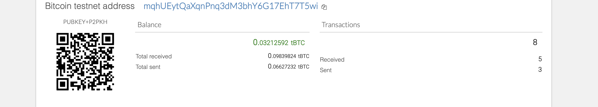
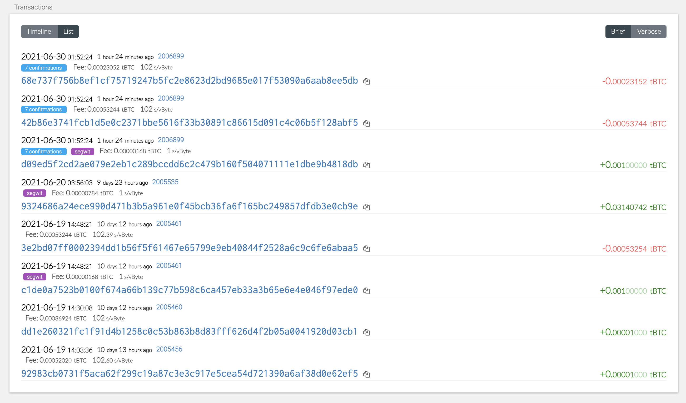

# blockchain_wallet

## Overview
  This is a wallet that uses a mnemonic, BIP39 and BIP44, as well as certain functions to create and send transactions. The mnemonic is a 12 word seed phrase that is randomly generated by the BIP39 protocol. The [mnemonic](https://iancoleman.io/bip39/) tool can help with generating a new 12 word mnemonic. Utilizing the BIP44 portocol we can generate addresses, public and private keys among multiple different coins using only one seed phrase. In my example of this wallet, I specifically used Ethereum and test BTC. The wallet itself is built using various functions that require the coin you are using and the mnenoic, the rest can be generated from within the functions of the wallet. 
  
### Dependencies

  - HD-wallet-derive
  - [Bit](https://ofek.dev/bit/)
  - [Web3](https://github.com/ethereum/web3.py)
